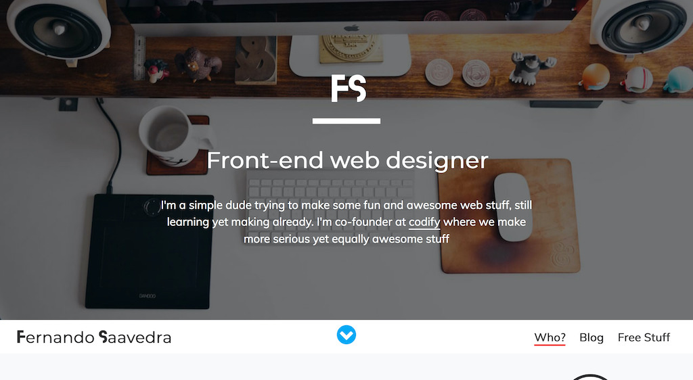

First of... welcome 😏 whoever you are, whenever you're reading. It's taken too long for this website to exist so it's nice to have someone hanging around — cheers 🍻. 

Do people normally click other people's website linked on their Twitter bio and look around even though you're not looking for something specific? I do, in fact a while back I even had a _lists_ (the Twitter kind, not like a sociopath's list of names) specifically for people's whose websites I found to be cool.

I mean I like websites... that's sort of what I do for a living. And I've always wanted one of my own, don't really knew why at the moment, it's not like I was looking for a job or anything at the beginning but anyhow, the point is that that it's been a push-down-the-line kind of a project for what? over 5 years now? 6?

And boy did I had some ideas along the road...

## Which brings us to this year

It's been almost 2 years now since I graduated from college and a bit more since I began my _professional_ career as a web developer so I figured it was time for me to put myself out there. 

Wether I'd like to move another job or start doing some side freelancing I'd need to have a website/portfolio to showcase my work, it was time. No more procrastinating on it.

Sure it still took me a couple of months to get this out — 6 months (!) according to the git history of the repo. But considering that I did this as side work from my real job during a pandemic and that it went through one and a half redesigns in that time frame...I'm quite happy with it and even more that it's finally out in the wild!

So, I was really hoping for this very first post to be about the technical implementation of the site, y'know all the good stuff. But I think I went too off topic now so I decided to leave that for the **next** one!

Gotta fill that `js ·· /blog` page somehow ¯\\_(ツ)_/¯

Till next time, folks 👋

