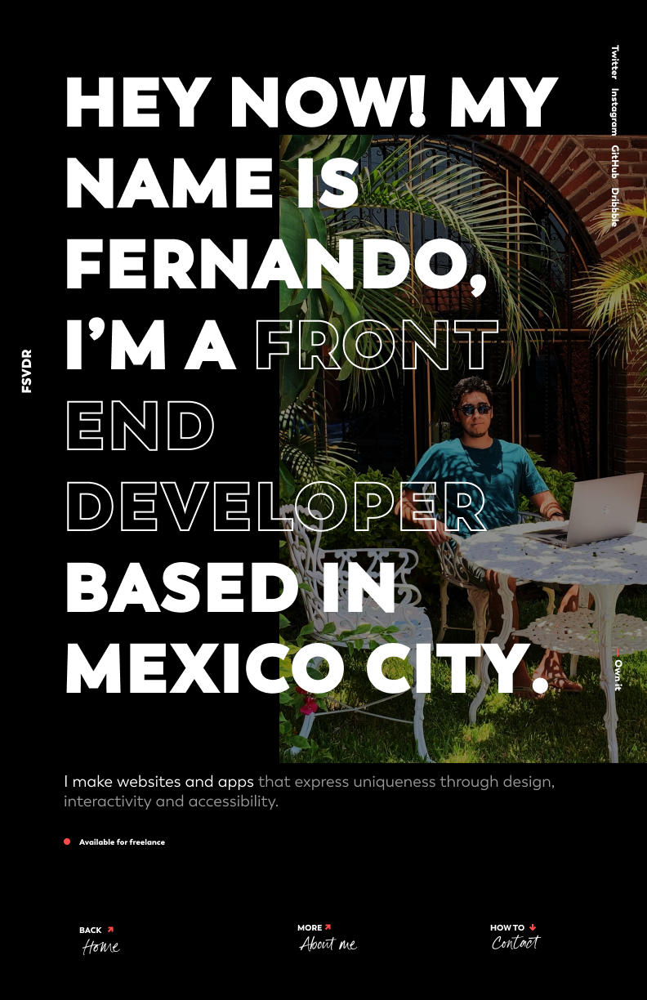
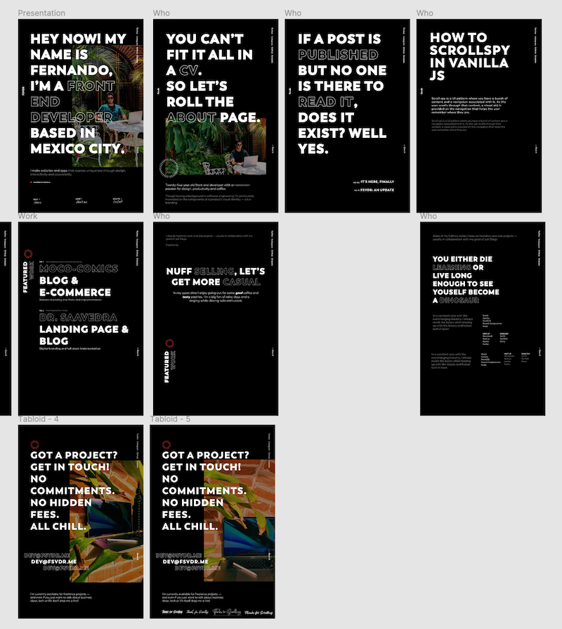

We're back folks! And this time I bring all the goodies behind the development of this site, just as I promised in the last post! I gotta say tho, I thought I'd give up with this blog after the release hype so the fact that I'm still writing this is... uhm... *pretty neat* 👌.

## But maaa, it has too look great!

Honestly I think the reason I kept pushing this site down the line is that I focused — nay, __obsessed__ too much over the design. I wanted it to be unique, modern, playful, stylish, minimalist, brutalist, full of animations, text-over-white simple! __UUUUUGHHH__ the possibilities burden!

Which is why early on this year, when I opened that dusty Sketch file with all the previous design iterations in it, I took a minute to see if I happened to still liked one. Could I stick to one of those designs and sget it through the finish line? 😃

No, I thought I could... but couldn't. __But this time!__ This time I would do things right, and stick to it. I opened Dribbble, Twitter, Pinterest and every other portfolio/blog that I had liked and kept for future reference. 

Over my years in college I would often help designing flyers and posters for events — I liked that, good times. It's with these small projects that I felt most creative so I figured I could try designing my site as a series of posters. Focusing heavily on typography and content would keep me out of thinking too much about colors, backgrounds and images which had been huge blockers for me in the past.

I figured "I don't really have much to say so I'll make text real big and bold to fill all that space 🙂". And I think it did the trick!

Once I felt confident with the direction of the first poster the rest of the site came easier, I don't usually design every single screen/state combination of a website — I'm too impatient for it tbh. So I kept going with the landing page and the first part of the about page with this poster-design approach and at some point the visual language became clear enough so that I could move to the code and let the rest of the site to align to it.

Now of course this ain't a legit design process, in terms of design I identify with this guy

but hey, one can dream! And also, I think it didn't turn too bad if I may weight in. 🤓 

## The JAMstack

With the very first version of this site back in 2015 (maybe?) I went all in with vanilla JS, vanilla CSS and of course vanilla HTML — again, good times. But of course over the time the web became... a bit more complex than that. 

The prior version to this (which was just a pretty work-in-progress notice) was running on pretty much the same stack except with the addition of PostCSS and my custom go-to ITCSS base styling.

This time I knew I wanted to go with Gatsby from day one. I wouldn't need a server at all, all my pages would be, well... pages and I was definitely going to avoid configuring a build tool or any kind of tooling at all for the sake of getting lost on the process. So the ease of use, performance optimizations and focus on accessibility that Gatsby provides out of the box was a no-brainer for me.

The one thing I did change halfway in was using Styled Components instead of my ITCSS-PostCSS styles. I didn't like how decoupled things felt having HTML and JavaScript already in well, JavaScript. Also, making that circular text "badge" you can see next to the title of this post was soooo cool and easy with Styled Components.

Finally, for this blog I didn't felt like using an external CMS would be too much overkill, I could get by with plain Markdown files for the posts (at least for now). Hopefully once [GitHub Codespaces](https://github.com/features/codespaces) is out it'll be even easier to create posts on the go!

## Netlify ecosystem and the serverless hype

Where do you host a Gatsby site? Well, anywhere really but I think Gatsby+Netlify is a popular choice nowadays. 

Netlify's free tier along with their [Build Plugins](https://docs.netlify.com/configure-builds/build-plugins) and simplified serverless functions were enough to bring me on board. 

In order to boost the SEO of my site I used `gatsby-plugin-feed` to create an RSS feed of the blog and `gatsby-plugin-sitemap` and `netlify-plugin-submit-sitemap` to create a sitemap and submit it to search engines.

Now, I've never really dived into serverless mostly because my whole concept of it sums up to a mental image of the AWS's console which... let's be honest looks daunting to newcomers. But then I heard [this Syntax.fm episode](https://syntax.fm/show/247/hasty-treat-wes-new-personal-website) where Wes Bos describes his new website and how he used Netlify [serverless] functions to query social media data and generate Twitter and Open Graph images.

It seemed quite straightforward and I was definitely sold on the idea of automatically generated social images so that I wouldn't have to worry about that 👍

## It doesn't need to be perfect...

There's still a couple of things I have planned for the site but I knew that if I waited for those I would never release this thing. So, couple of things I'm looking forward:

1. Using [Plausible's privacy-friendly analytics](https://plausible.io/) — Because I would like to know how my site is performing but I'm also privacy aware — cheers 🍻
2. Adding i11n support — So that I can have the site in spanish as well as english and it still makes sense to search engines.
3. Using [TinaCMS](https://tinacms.org/) — I'd like to be able to change the Spotify songs in the `javascript ·· /about` page and other details without having to open the code but I don't really need a full-blown CMS...

Overall I'm quite happy with how things turned out here and I learned a lot in the process. It was __hard__ to push myself through the finish line, I had to keep reminding me that web development is a never ending process, if you wait till everything is in place and perfect you'll most likely end up pushing things down the line for 5 years. 

Anyhow, that's it, that's all I've got! If you're curious about the actual code you can check it out [here](https://github.com/fsvdr/dot-me).

Till next time, folks! 👋